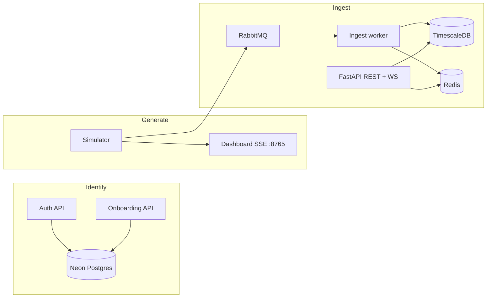

# Volta.ai docs

Interview and implementation notes for the Suryaa / Volta solar-home stack. Each note is a **separate** vertical slice — nothing is merged.

Open the [visual docs hub](./index.html) in a browser for the designed UI, or read the Markdown files in the editor / GitHub preview.

```
docs/
├── index.html                 Visual hub (dark teal / sun-gold)
├── auth.md                    Password + Google OAuth
├── onboarding.md              Post-signup solar wizard
├── simulator.md               Tick physics + live dashboard
├── telemetry_ingest.md        RabbitMQ → worker → Timescale + Redis
├── auth.html · onboarding.html · simulator.html · telemetry-ingest.html
└── assets/                    Shared CSS + JS
```

Source `.txt` files stay in this folder as the raw revision notes. The `.md` files are the formatted guides.

---

## Read in this order

| # | Guide | What it answers | Stack |
|---|--------|-----------------|--------|
| 1 | [Auth](./auth.md) | How a user JWT is issued | FastAPI · Neon · PyJWT · Google OIDC |
| 2 | [Onboarding](./onboarding.md) | How a home is configured after signup | FastAPI · 4 tables · JWT reuse |
| 3 | [Simulator](./simulator.md) | How **one tick** is calculated | Pydantic · Open-Meteo · stdlib SSE |
| 4 | [Telemetry ingest](./telemetry_ingest.md) | What happens **after** the tick is JSON | RabbitMQ · Timescale · Redis · WS |

Do not mix the last two. The simulator never sees Redis or Timescale. The ingest worker never computes PV physics.

---

## Architecture at a glance



| Process | Command | Needs JWT? |
|---------|---------|------------|
| Auth / onboarding / energy reads | `uvicorn main:app` | Yes on protected routes |
| Ingest worker | `python -m app.workers.ingest` | No |
| Simulator | `python -m simulator.main --dashboard` | No |
| Infra | `docker compose up -d` | — |

---

## Visual pages

| Page | File | Markdown |
|------|------|----------|
| Hub | [index.html](./index.html) | This file |
| Auth | [auth.html](./auth.html) | [auth.md](./auth.md) |
| Onboarding | [onboarding.html](./onboarding.html) | [onboarding.md](./onboarding.md) |
| Simulator | [simulator.html](./simulator.html) | [simulator.md](./simulator.md) |
| Telemetry ingest | [telemetry-ingest.html](./telemetry-ingest.html) | [telemetry_ingest.md](./telemetry_ingest.md) |

---

## Elevator lines

**Auth.** Layered FastAPI: routers → services → repositories. Bcrypt passwords, short-lived JWT access, hashed rotated refresh, Google OIDC with verified-email linking.

**Onboarding.** Conditional wizard. On-grid skips battery, off-grid skips grid, hybrid needs both. Four normalized tables. Completes only when required steps exist.

**Simulator.** One tick composes weather, PV, load, battery, and grid. Night solar is zero. Charge and discharge are separate kW fields. Energy-balance warnings never stop the loop.

**Ingest.** Simulator publishes. Worker validates, upserts Timescale, updates Redis, then ACKs. API serves JWT REST + WebSocket. Auth stays on Neon.
