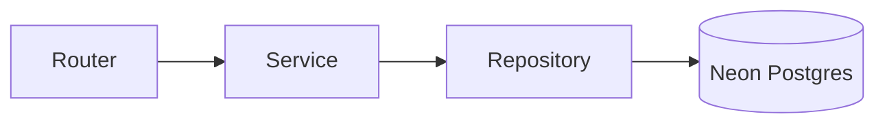
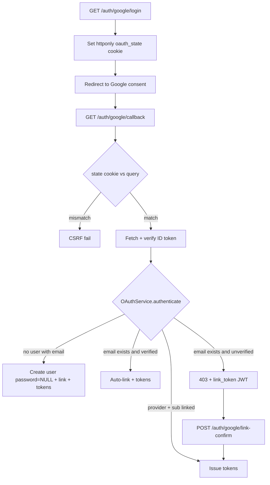

# Auth

Password signup, Google OAuth, JWT access tokens, and hashed refresh rotation for the Suryaa / Volta stack.

| | |
|---|---|
| **Project** | FastAPI Auth API |
| **Stack** | Python 3.12 · FastAPI · SQLAlchemy 2.0 async · Alembic · Neon Postgres |
| **Security** | PyJWT · passlib (bcrypt) · httpx · slowapi · Pydantic v2 |

> **Interview line.** Routers stay thin. Business logic lives in services. DB access lives in repositories. `Depends` injects them so tests can override.

**Sister docs:** [Onboarding](./onboarding.md) · [Simulator](./simulator.md) · [Telemetry ingest](./telemetry_ingest.md) · [Docs hub](./README.md)

---

## On this page

1. [Memory map](#1-memory-map)
2. [Database schema](#2-database-schema)
3. [API endpoints](#3-api-endpoints)
4. [Code workflows](#4-code-workflows)
5. [Security checklist](#5-security-checklist)
6. [Dependency injection](#6-dependency-injection)
7. [Errors](#7-errors)
8. [Config](#8-config)
9. [Testing](#9-testing)
10. [Trade-offs](#10-trade-offs)
11. [Elevator pitch](#11-elevator-pitch)
12. [Cheat sheet](#12-cheat-sheet)

---

## 1. Memory map

### Request flow

```
Router  →  Service  →  Repository  →  Model / DB
(HTTP)     (business)   (DB only)      (tables)
```

| Layer | Job |
|---|---|
| `schemas/` | Request / response validation (Pydantic) |
| `core/` | Config, security, DB session, DI, errors, rate limit |
| `modules/auth/` | Vertical slice: password + Google OAuth |



### Folder map

```
backend/
  main.py                 ASGI re-export (`uvicorn main:app`)
  .env                    Secrets — never commit
  alembic/                DB migrations
  tests/                  pytest + httpx.AsyncClient (in-memory SQLite)

  app/
    main.py               CORS, rate limit, routers, exception handlers
    core/
      config.py           pydantic-settings from .env
      database.py         async engine + get_db() (commit / rollback)
      security.py         bcrypt, JWT create/decode, opaque token hash
      deps.py             get_current_user + auth dep re-exports
      exceptions.py       AppError + consistent error JSON
      rate_limit.py       slowapi Limiter
      types.py            portable GUID (Postgres UUID / SQLite tests)

    models/
      user.py
      refresh_token.py
      auth_provider.py
      password_reset_token.py

    modules/auth/
      router.py           /auth/signup|login|refresh|logout|me|password-reset
      oauth_router.py     /auth/google/login|callback|link-confirm
      schemas.py          Login, TokenResponse, Refresh, Reset, OAuth link
      user_schemas.py     UserCreate, UserOut
      service.py          signup, login, password reset
      token_service.py    issue / rotate / revoke tokens
      oauth_service.py    account linking policy
      deps.py             FastAPI Depends (repos, services, Google client)
      repositories/       Pure DB read/write — no business rules
      oauth/
        base.py           OAuthProviderClient interface
        google.py         Google OIDC + ID token verify

    modules/onboarding/   Separate solar-setup slice
```

---

## 2. Database schema

Four tables. `auth_providers` is separate so many providers can be linked later without a `google_id` column on `users`.

### `users`

| Column | Notes |
|---|---|
| `id` | UUID PK |
| `name` | Required on password signup; from Google name / email local-part for OAuth |
| `email` | Unique |
| `hashed_password` | **Nullable.** `NULL` = OAuth-only user, password login disabled |
| `is_active` | Soft disable |
| `created_at` | Timestamp |

### `refresh_tokens`

| Column | Notes |
|---|---|
| `id`, `user_id` | FK to users |
| `token_hash` | SHA-256 of the raw token — **never store the raw refresh token** |
| `expires_at` | ~7 days |
| `revoked_at` | `NULL` = active |
| `created_at` | Timestamp |

### `auth_providers`

| Column | Notes |
|---|---|
| `id`, `user_id` | FK to users |
| `provider` | `"google"`, later `"github"`… |
| `provider_user_id` | Google `sub` |
| Unique | `(provider, provider_user_id)` |

**Why a separate table?** One user can link Google + GitHub later without a schema change. Do not hardcode `google_id` on `users`.

### `password_reset_tokens`

| Column | Notes |
|---|---|
| `id`, `user_id` | FK to users |
| `token_hash` | Opaque token, hashed |
| `expires_at` | ~30 min |
| `used_at` | Single-use |

---

## 3. API endpoints

### Password auth

| Method | Path | Result |
|---|---|---|
| `POST` | `/auth/signup` | `201` `UserOut` (name + email, no password) |
| `POST` | `/auth/login` | Access + refresh tokens (rate limited) |
| `POST` | `/auth/refresh` | Rotate refresh, new pair |
| `POST` | `/auth/logout` | Revoke refresh token (`204`) |
| `GET` | `/auth/me` | Current user (Bearer access JWT) |
| `POST` | `/auth/password-reset/request` | Always `204` (no email enumeration) |
| `POST` | `/auth/password-reset/confirm` | Set new password via token |

### Google OAuth

| Method | Path | Result |
|---|---|---|
| `GET` | `/auth/google/login` | Redirect to Google + set `state` cookie |
| `GET` | `/auth/google/callback` | Exchange code, login / link / create, tokens |
| `POST` | `/auth/google/link-confirm` | Link when Google email is not verified |

### Health

| Method | Path |
|---|---|
| `GET` | `/health` |

> **Frontend note.** “Sign in with Google” and “Sign up with Google” both hit `/auth/google/login`. The backend decides signup vs login from whether the user or link already exists.

---

## 4. Code workflows

### A. Signup (email + password)

1. Router validates `UserCreate` (`name`, `email`, password min 8).
2. `AuthService.signup`:
   - if email exists → `409 email_already_registered`
   - hash password with bcrypt
   - `UserRepository.create(email, hashed_password, name)`
3. `get_db` commits.
4. Return `201 UserOut` (`id`, `email`, `is_active`, `created_at`) — never the password.

### B. Login

1. Rate limit: **5 / minute** (slowapi).
2. `AuthService.login`:
   - find user by email
   - if missing **or** `hashed_password` is `NULL` **or** wrong password **or** inactive → same `401` `"Incorrect email or password"` (no user enumeration)
   - `TokenService.issue_token_pair(user_id)`
3. Return `{ access_token, refresh_token, token_type: "bearer" }`.

### C. Token pair

#### Access token — JWT, ~15 min

- Signed **HS256** with `JWT_SECRET_KEY`
- Payload: `sub=user_id`, `type=access`, `iat`, `exp`, `jti`
- Sent as `Authorization: Bearer <token>`
- Used by `get_current_user` for `/me` and protected routes
- **Not stored in the DB** (stateless)

#### Refresh token — opaque random string, ~7 days

- `secrets.token_urlsafe(64)`
- **Only** the SHA-256 hash is stored in `refresh_tokens`
- Raw token is returned to the client once
- Used only on `/auth/refresh` and `/auth/logout`

> **Why hash refresh tokens?** A DB leak alone cannot reuse them.

### D. Refresh (rotation)

1. Client sends the raw `refresh_token`.
2. Hash it, look up in the DB.
3. If missing / expired / revoked:
   - if already revoked (reuse) → **revoke all user sessions** (theft signal)
   - raise `401 invalid_token`
4. Revoke the old token (`revoked_at`).
5. Issue a **new** access + **new** refresh pair.
6. The old refresh can never be used again.

> **Interview keyword.** Refresh token rotation + reuse detection.

### E. Logout

1. Hash the refresh token, find the row.
2. Set `revoked_at = now`.
3. Idempotent — already revoked still returns `204`.
4. The access token stays valid until expiry (short-lived by design). Optional later: access-token blacklist / shorter TTL.

### F. `GET /me` (protected)

1. `Depends(get_current_user)`
2. Parse the Bearer header.
3. `jwt.decode` (signature + expiry).
4. `type` must be `"access"`.
5. Load user by `sub` UUID.
6. Missing / inactive → `401`.
7. Return `UserOut`.

### G. Password reset

**Request**

- Always return `204` even if the email is unknown (no enumeration).
- If the user exists: create an opaque token, store the hash, expire in 30 min.
- Stub: print the token (would email in production).

**Confirm**

- Hash the token, find the row.
- Must be unused and not expired.
- Set a new bcrypt password.
- Mark `used_at` (single-use).

### H. Google OAuth — full flow



1. **`GET /auth/google/login`**
   - Generate random `state`
   - Set httponly cookie `oauth_state`
   - Redirect to Google consent (`openid email profile`)

2. User approves on Google.

3. **`GET /auth/google/callback?code=&state=`**
   - Compare state cookie vs query with `secrets.compare_digest` (CSRF).
   - `GoogleOAuthClient.fetch_user_info(code)`:
     1. POST code to Google token endpoint
     2. Get `id_token`
     3. Verify signature via Google JWKS (RS256)
     4. Check `aud == GOOGLE_CLIENT_ID`
     5. Check `iss` is Google
     6. Extract `sub`, `email`, `email_verified`, `name`
   - `OAuthService.authenticate(info)`:

| Condition | Result |
|---|---|
| `provider + sub` already linked | Issue tokens for that user |
| No user with that email | Create user (`password=NULL`), create `auth_providers` link, issue tokens (**sign up**) |
| Email exists **and** `email_verified=true` | Auto-link Google, issue tokens (**sign in + link**) |
| Email exists **and** `email_verified=false` | `403 oauth_link_confirmation_required` + short-lived `link_token` JWT. **Do not auto-link** — account takeover risk |

4. **`POST /auth/google/link-confirm`** (edge case)
   - Decode `link_token`
   - User proves password on the existing account
   - Then create `auth_providers` link + issue tokens

**Provider-agnostic design.** `OAuthProviderClient` interface + `GoogleOAuthClient`. Adding GitHub = new client + router, same `OAuthService` linking policy.

---

## 5. Security checklist

- [ ] Passwords: bcrypt via passlib — never store or log plaintext
- [ ] Access JWT: HS256, short-lived (~15 min), secret from env
- [ ] Refresh: opaque, hashed (SHA-256) in DB, rotated on use
- [ ] Reuse of a revoked refresh → revoke **all** sessions for that user
- [ ] Login / reset request: rate limited (slowapi)
- [ ] Login errors: generic message (no email existence leak)
- [ ] Signup duplicate: `409`
- [ ] CORS: explicit origins only (never `*`) with credentials
- [ ] Secrets only in `.env` (`DATABASE_URL`, `JWT_SECRET`, Google keys)
- [ ] OAuth: verify ID token signature + `aud` + `iss` server-side
- [ ] OAuth: state cookie prevents CSRF on callback
- [ ] Never auto-link OAuth unless `email_verified=true`
- [ ] OAuth-only users: `hashed_password=NULL` → password login disabled
- [ ] Error shape always: `{"success":false,"error":{"code":"...","message":"..."}}`

---

## 6. Dependency injection

FastAPI `Depends` wires:

```
get_db
  → UserRepository / RefreshTokenRepository / …
    → AuthService / TokenService / OAuthService
      → used in routers

get_current_user(Authorization header)
  → decode JWT → load User

get_google_oauth_client()
  → returns OAuthProviderClient interface (easy to fake in tests)
```

> **Interview line.** Routers stay thin; business logic in services; DB access in repositories; `Depends` injects them so tests can override.

---

## 7. Errors

Success responses use normal FastAPI / Pydantic models. Errors go through centralized handlers:

```json
{
  "success": false,
  "error": {
    "code": "invalid_credentials",
    "message": "Incorrect email or password"
  }
}
```

| Status | Codes |
|---|---|
| `400` | `validation_error` |
| `401` | `invalid_credentials` / `invalid_token` |
| `403` | `forbidden` / `oauth_link_confirmation_required` |
| `409` | `email_already_registered` |
| `429` | `rate_limited` |
| `500` | `internal_error` — never leak stack traces |

---

## 8. Config

No code change to switch Neon ↔ local. Change `.env`, then `alembic upgrade head`.

| Key | Notes |
|---|---|
| `DATABASE_URL` | `postgresql+asyncpg://…` |
| `DB_SSL_REQUIRED=true` | Neon / Supabase |
| `DB_SSL_REQUIRED=false` | Local Postgres |
| `JWT_SECRET_KEY` | Signs access + link tokens |
| `GOOGLE_CLIENT_ID` | OIDC audience |
| `GOOGLE_CLIENT_SECRET` | Token exchange |
| `GOOGLE_REDIRECT_URI` | Callback URL |

asyncpg SSL is via `connect_args={"ssl":"require"}`, **not** `?sslmode=` in the URL.

---

## 9. Testing

- pytest + `httpx.AsyncClient` against the FastAPI app
- In-memory SQLite (`aiosqlite`) + portable GUID type
- Transaction rollback per test (isolation)
- Google tests: `FakeGoogleClient` overrides `get_google_oauth_client` — no real network; tests the linking policy

**Covered:** signup, duplicate, wrong password, `/me` invalid / expired, refresh rotation + reuse revoke-all, logout, OAuth create / link / unverified.

---

## 10. Trade-offs

<dl>

<dt>Why HS256, not RS256?</dt>
<dd>This service both issues and verifies tokens. HS256 is simpler. Switch to RS256 later if other microservices must verify without sharing the secret.</dd>

<dt>Why PyJWT, not python-jose?</dt>
<dd>python-jose is poorly maintained and had CVEs. PyJWT is standard and has a JWKS client.</dd>

<dt>Why SHA-256 for refresh tokens, bcrypt for passwords?</dt>
<dd>Refresh tokens are high-entropy random (fast hash is OK). Passwords are low-entropy human strings (need a slow KDF = bcrypt).</dd>

<dt>Why not blacklist access tokens on logout?</dt>
<dd>Access tokens are short-lived (15 min). Refresh is revoked immediately. A blacklist adds Redis complexity — an acceptable trade-off for this design.</dd>

<dt>Why SQLite in tests?</dt>
<dd>Speed + zero external deps. Models avoid Postgres-only features via a GUID type. Production is still Postgres (Neon / local).</dd>

<dt>Why in-memory rate limit?</dt>
<dd>Fine for a single process. Multi-instance needs a Redis-backed limiter.</dd>

</dl>

---

## 11. Elevator pitch

> I built a production-style FastAPI auth service with layered architecture: routers → services → repositories → models. Password signup / login uses bcrypt and issues a short-lived JWT access token plus a hashed, rotated refresh token. Google OAuth uses OpenID Connect with ID-token verification and a provider-agnostic `auth_providers` table so we can add GitHub later. Account linking only auto-links when Google reports `email_verified`; otherwise the user must confirm with their password. Security includes generic login errors, rate limiting, CSRF state on OAuth, and consistent error responses. Config is env-driven so we can switch Neon cloud Postgres to local without code changes.

---

## 12. Cheat sheet

| Topic | File |
|---|---|
| Architecture entry | `app/main.py` (`uvicorn main:app` still works) |
| Config | `app/core/config.py` |
| DB commit pattern | `app/core/database.py` (`get_db` commit / rollback) |
| JWT + bcrypt | `app/core/security.py` |
| Current user DI | `app/core/deps.py` |
| Password auth logic | `app/modules/auth/service.py` |
| Token rotation | `app/modules/auth/token_service.py` |
| OAuth linking policy | `app/modules/auth/oauth_service.py` |
| Google ID token verify | `app/modules/auth/oauth/google.py` |
| Auth routes | `app/modules/auth/router.py` |
| OAuth routes | `app/modules/auth/oauth_router.py` |
| Migration | `alembic/versions/202608050001_initial_auth_schema.py` |
