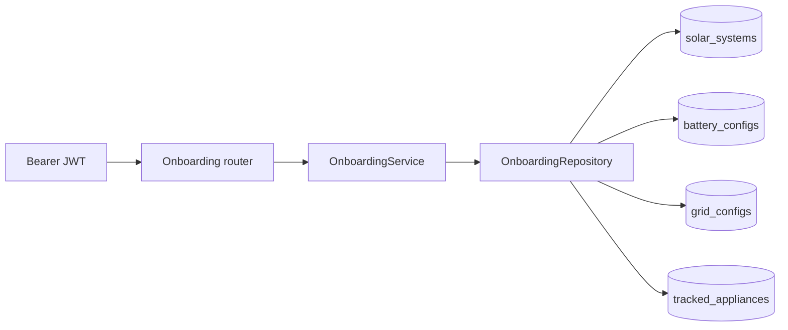
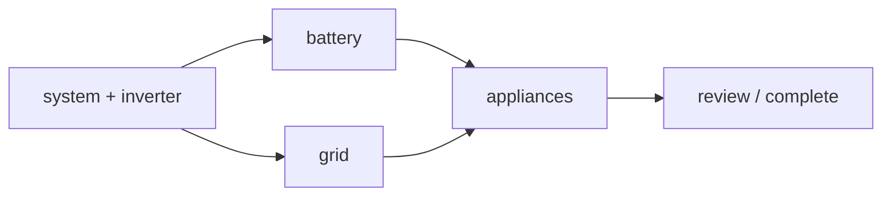

# Onboarding

Post-signup solar setup wizard. Conditional steps by system type. Four normalized tables. JWT reused from auth.

| | |
|---|---|
| **Project** | FastAPI Onboarding API |
| **Stack** | Python 3.12 · FastAPI · SQLAlchemy 2.0 async · Alembic · Neon Postgres |
| **Auth** | Pydantic v2 · JWT via shared `get_current_user` |

> **Interview line.** Onboarding reuses the auth layer’s `get_current_user` — no duplicate JWT logic. Each module owns its own repo / service; `core/` only holds shared infrastructure.

**Sister docs:** [Auth](./auth.md) · [Simulator](./simulator.md) · [Telemetry ingest](./telemetry_ingest.md) · [Docs hub](./README.md)

---

## On this page

1. [Memory map](#1-memory-map)
2. [Database schema](#2-database-schema)
3. [API endpoints](#3-api-endpoints)
4. [Conditional steps](#4-conditional-steps)
5. [Request fields](#5-request-fields)
6. [Code workflows](#6-code-workflows)
7. [Frontend flow](#7-frontend-flow)
8. [Dependency injection](#8-dependency-injection)
9. [Errors](#9-errors)
10. [UI → API mapping](#10-ui--api-mapping)
11. [Design decisions](#11-design-decisions)
12. [Elevator pitch](#12-elevator-pitch)
13. [Cheat sheet](#13-cheat-sheet)

---

## 1. Memory map

### Request flow

```
Router  →  Service  →  Repository  →  Model / DB
(HTTP)     (business)   (DB only)      (tables)
```

| Layer | Job |
|---|---|
| `schemas/` | Request / response validation (Pydantic) |
| `enums.py` | Domain constants (`PanelType`, `SystemType`, `ApplianceKey`, …) |
| `core/` | Shared config, DB session, `get_current_user`, `AppError` handlers |

Onboarding lives as a self-contained module under `app/modules/onboarding/`. Auth has the same shape: `app/modules/auth/` (router, service, repos, oauth).



### Folder map

```
backend/
  main.py                 ASGI re-export; app lives in app/main.py
  alembic/versions/
    202608220001_onboarding_schema.py   4 new tables

  app/
    core/
      deps.py             get_current_user() — shared by auth + onboarding
      exceptions.py       AppError + onboarding-specific errors

    models/__init__.py    Imports onboarding ORM models for Alembic

    modules/
      auth/               Password + Google OAuth vertical slice
      onboarding/
        enums.py          PanelType, SystemType, InverterBrand, BackupHours,
                          MeterType, TariffType, ApplianceKey, OnboardingStep
        models.py         SolarSystem, BatteryConfig, GridConfig, TrackedAppliance
        schemas.py        SystemStepIn, BatteryStepIn, GridStepIn, AppliancesStepIn,
                          OnboardingStatusOut, OnboardingSummaryOut
        repository.py     Pure DB read/write (upsert, replace, delete stale)
        service.py        system_type guards, step completion logic
        deps.py           get_onboarding_service() Depends wiring
        router.py         /onboarding/* endpoints
```

---

## 2. Database schema

Four tables — not one JSON blob.

### `solar_systems` — one per user (`UNIQUE user_id` FK → `users`)

| Column | Notes |
|---|---|
| `id` | UUID PK |
| `user_id` | FK, unique, `CASCADE DELETE` |
| `panel_type` | Monocrystalline · Polycrystalline · Thin-film · Bifacial |
| `panel_qty` | Integer ≥ 1 |
| `system_type` | On-grid · Off-grid · Hybrid |
| `location` | Nullable |
| `avg_monthly_bill` | Nullable, INR |
| `inverter_brand` | Same row — UI steps 1+2 map to one API call |
| `inverter_capacity_kw` | ≥ 1 |
| `last_step` | Furthest step completed |
| `appliances_configured` | True once step 5 is submitted |
| `is_complete` | True after `POST /complete` |
| `completed_at` | Nullable |
| `created_at` / `updated_at` | Timestamps |

### `battery_configs` — one per system (`UNIQUE system_id`)

Only for **Off-grid / Hybrid**.

| Column | Constraint |
|---|---|
| `battery_capacity_kwh` | ≥ 1 |
| `backup_hours` | `CHECK IN (2, 4, 8)` |
| `reserve_pct` | `CHECK BETWEEN 5 AND 50` (minimum SOC floor) |

Deleted automatically if `system_type` changes to On-grid.

### `grid_configs` — one per system (`UNIQUE system_id`)

Only for **On-grid / Hybrid**.

| Column | Notes |
|---|---|
| `meter_type` | Net metering · Gross metering · No export |
| `sanctioned_load_kw` | ≥ 1 |
| `tariff_type` | Flat rate · Time-of-use · Slab-based |
| `discom` | Nullable |

Deleted automatically if `system_type` changes to Off-grid.

### `tracked_appliances` — many per system

| Column | Notes |
|---|---|
| `appliance_key` | `wash` · `heater` · `ev` · `pump` · `ac` · `fridge` |
| `is_critical` | True = never auto-off (UI “lock” toggle) |
| Unique | `(system_id, appliance_key)` |

Replaced wholesale on each `PUT /appliances` (delete all + re-insert).

> **Why 4 tables, not 1 JSON blob?** `battery_configs` / `grid_configs` are absent for irrelevant system types. DB `CHECK` constraints enforce valid `backup_hours`, `reserve_pct`, `appliance_key`. Easy to query “all Hybrid users with battery &lt; 5 kWh” later. Clean cascade delete when a user is removed.

---

## 3. API endpoints

All routes require `Authorization: Bearer <access_token>`. Prefix: `/onboarding`.

### Write

| Method | Path | Step | Who |
|---|---|---|---|
| `PUT` | `/onboarding/system` | 1+2: panel + inverter | All system types |
| `PUT` | `/onboarding/battery` | 3: battery | Off-grid / Hybrid only |
| `PUT` | `/onboarding/grid` | 4: grid + tariff | On-grid / Hybrid only |
| `PUT` | `/onboarding/appliances` | 5: appliance selection | All system types |
| `POST` | `/onboarding/complete` | Finalise → unlock dashboard | When required steps exist |

### Read

| Method | Path | Purpose |
|---|---|---|
| `GET` | `/onboarding/status` | Progress: completed / required / remaining |
| `GET` | `/onboarding/summary` | Full dump for the Review screen |

> After `POST /auth/signup` → start onboarding. Login skips it and goes to the dashboard. `GET /onboarding/status` tells the frontend which step to resume after reload.

---

## 4. Conditional steps

The UI has 6 wizard panels. Backend required steps vary by `system_type`.



| Type | UI path | Required for `POST /complete` |
|---|---|---|
| **On-grid** | system → inverter → skip battery → grid → appliances → review | system + grid + appliances |
| **Off-grid** | system → inverter → battery → skip grid → appliances → review | system + battery + appliances |
| **Hybrid** | system → inverter → battery → grid → appliances → review | system + battery + grid + appliances |

### Service guards

| Call | Error |
|---|---|
| `PUT /battery` on On-grid | `422 system_type_conflict` |
| `PUT /grid` on Off-grid | `422 system_type_conflict` |
| Any step before system | `404 onboarding_not_found` |
| `POST /complete` twice | `409 onboarding_already_complete` |
| `POST /complete` missing steps | `403 forbidden` (lists missing step names) |

### `system_type` change side-effects (`PUT /system` re-submit)

| From → To | Cleanup |
|---|---|
| Hybrid → On-grid | Delete `battery_configs` row |
| Hybrid → Off-grid | Delete `grid_configs` row |
| Off-grid → On-grid | Delete `battery_configs` row |

---

## 5. Request fields

### A. `PUT /onboarding/system` — all types

| Field | Values |
|---|---|
| `panel_type` | Monocrystalline · Polycrystalline · Thin-film · Bifacial |
| `panel_qty` | Integer ≥ 1 |
| `system_type` | On-grid · Off-grid · Hybrid |
| `location` | String ≤ 200 (optional) |
| `avg_monthly_bill` | Decimal ≥ 0 INR (optional — not shown on Review) |
| `inverter_brand` | Fronius · SolarEdge · Growatt · Huawei FusionSolar · Other |
| `inverter_capacity_kw` | Decimal ≥ 1 |

### B. `PUT /onboarding/battery` — Off-grid / Hybrid only

| Field | Values |
|---|---|
| `battery_capacity_kwh` | Decimal ≥ 1 |
| `backup_hours` | `2` · `4` · `8` |
| `reserve_pct` | Integer 5–50 (% — hard safety floor) |

On-grid: **do not send** — returns `422`.

### C. `PUT /onboarding/grid` — On-grid / Hybrid only

| Field | Values |
|---|---|
| `meter_type` | Net metering · Gross metering · No export |
| `sanctioned_load_kw` | Decimal ≥ 1 |
| `tariff_type` | Flat rate · Time-of-use · Slab-based |
| `discom` | String ≤ 100 (optional) |

Off-grid: **do not send** — returns `422`.

### D. `PUT /onboarding/appliances` — all types

```json
{
  "appliances": [
    { "appliance_key": "wash", "is_critical": false }
  ]
}
```

Empty list is valid. No duplicate `appliance_key` in one request.

| Key | Appliance | Watts | Notes |
|---|---|---|---|
| `wash` | Washing Machine | 750 W | |
| `heater` | Water Heater | 2000 W | |
| `ev` | EV Charger | 3300 W | |
| `pump` | Pool Pump | 900 W | |
| `ac` | Air Conditioner | 1500 W | |
| `fridge` | Refrigerator | 150 W | Default `is_critical=true` in UI |

---

## 6. Code workflows

### A. Save system (steps 1+2)

1. Router validates `SystemStepIn` (Pydantic).
2. `OnboardingService.save_system(user_id, data)`:
   - if no `solar_systems` row → `OnboardingRepository.create_system(...)`
   - if exists → `update_system(...)`; handle `system_type` transition cleanup
3. `last_step = "system"`
4. `get_db` commits.
5. Return `200 SolarSystemOut`.

### B. Save battery (step 3)

1. `_require_system()` → `404` if system step not done.
2. Check `system_type` in `{Off-grid, Hybrid}` → else `422 system_type_conflict`.
3. `OnboardingRepository.upsert_battery(...)` — create or update in-place.
4. `last_step = "battery"`
5. Return `200 SolarSystemOut`.

### C. Save grid (step 4)

1. `_require_system()` → `404` if system step not done.
2. Check `system_type` in `{On-grid, Hybrid}` → else `422 system_type_conflict`.
3. `OnboardingRepository.upsert_grid(...)`
4. `last_step = "grid"`
5. Return `200 SolarSystemOut`.

### D. Save appliances (step 5)

1. `_require_system()` → `404`.
2. `OnboardingRepository.replace_appliances(...)` — `DELETE` all + `INSERT` new list.
3. `appliances_configured = true`, `last_step = "appliances"`
4. Return `200 SolarSystemOut`.

### E. Complete onboarding

1. `_require_system()`
2. if `is_complete` → `409 onboarding_already_complete`
3. `_missing_steps()` compares required vs completed for this `system_type`
4. if any missing → `403 forbidden` with step names
5. `is_complete=true`, `completed_at=now()`, `last_step="complete"`
6. Return `200 OnboardingStatusOut`

### F. Get status (resume wizard)

1. Load `solar_systems` by `user_id` (may be null).
2. Compute `steps_required` from `system_type`.
3. Compute `steps_completed` from DB state:

| Step | Done when |
|---|---|
| `system` | `solar_systems` row exists |
| `battery` | `battery_configs` row exists |
| `grid` | `grid_configs` row exists |
| `appliances` | `appliances_configured == true` |

4. `steps_remaining = required − completed`
5. Return `OnboardingStatusOut`

### G. Get summary (Review screen)

1. `_require_system()` → `404`
2. Eager-load `battery_config`, `grid_config`, `appliances` (`selectinload`)
3. `battery=null` for On-grid, `grid=null` for Off-grid
4. Return `OnboardingSummaryOut` grouped by section

---

## 7. Frontend flow

Typical path after signup:

1. `POST /auth/signup` → get `access_token`
2. `GET /onboarding/status` → know which step to show
3. `PUT /onboarding/system` → always first
4. If Off-grid or Hybrid: `PUT /onboarding/battery`
5. If On-grid or Hybrid: `PUT /onboarding/grid`
6. `PUT /onboarding/appliances`
7. `GET /onboarding/summary` → populate Review
8. `POST /onboarding/complete` → redirect to dashboard

Login flow skips onboarding entirely (demo UI goes straight to the app).

---

## 8. Dependency injection

```
get_db
  → OnboardingRepository
    → OnboardingService
      → used in onboarding/router.py

get_current_user (from app/core/deps.py)
  → extracts JWT → loads User → all onboarding routes require this
```

> Onboarding reuses the auth layer’s `get_current_user` — no duplicate JWT logic. Each module owns its own repo / service; `core/` only holds shared infrastructure.

---

## 9. Errors

Same shape as the auth service:

```json
{
  "success": false,
  "error": {
    "code": "system_type_conflict",
    "message": "Battery configuration is not applicable for 'On-grid' systems."
  }
}
```

| Status | Code | When |
|---|---|---|
| `404` | `onboarding_not_found` | Step called before system step |
| `422` | `system_type_conflict` | Battery on On-grid **or** grid on Off-grid |
| `409` | `onboarding_already_complete` | `POST /complete` twice |
| `403` | `forbidden` | `/complete` with missing required steps |
| `400` | `validation_error` | Pydantic field validation |
| `401` | `invalid_token` | Missing / expired JWT |

---

## 10. UI → API mapping

Frontend demo (`suryaa_demo.html`) `obData` maps directly to the API:

| `obData` field | Endpoint | API field |
|---|---|---|
| `panelType` | `PUT /system` | `panel_type` |
| `panelQty` | `PUT /system` | `panel_qty` |
| `systemType` | `PUT /system` | `system_type` |
| `location` | `PUT /system` | `location` |
| `avgBill` | `PUT /system` | `avg_monthly_bill` |
| `inverterBrand` | `PUT /system` | `inverter_brand` |
| `inverterCapacity` | `PUT /system` | `inverter_capacity_kw` |
| `batteryCapacity` | `PUT /battery` | `battery_capacity_kwh` |
| `backupHours` | `PUT /battery` | `backup_hours` |
| `reservePct` | `PUT /battery` | `reserve_pct` |
| `meterType` | `PUT /grid` | `meter_type` |
| `sanctionedLoad` | `PUT /grid` | `sanctioned_load_kw` |
| `tariffType` | `PUT /grid` | `tariff_type` |
| `discom` | `PUT /grid` | `discom` |
| `appliances[]` | `PUT /appliances` | `appliances[].appliance_key` |
| `criticalAppliances[]` | `PUT /appliances` | `appliances[].is_critical=true` |

Review screen data → `GET /onboarding/summary`.  
“Enter dashboard” → `POST /onboarding/complete`.

---

## 11. Design decisions

<dl>

<dt>Why combine UI steps 1+2 (panel + inverter) into one API call?</dt>
<dd>Both fields live in the same <code>solar_systems</code> row. One PUT avoids partial state and matches the DB shape. The UI can still show two wizard screens — the frontend batches them into one request when step 2 is submitted.</dd>

<dt>Why wholesale replace for appliances instead of PATCH?</dt>
<dd>Simpler — the user’s full selection is the source of truth. Delete all rows for <code>system_id</code> then bulk insert. No stale rows, no diff logic.</dd>

<dt>Why store enums as VARCHAR, not a Postgres ENUM type?</dt>
<dd>Cheap migrations, works identically on the SQLite test DB, enum owned by Python.</dd>

<dt>Why separate <code>battery_configs</code> / <code>grid_configs</code> tables?</dt>
<dd>Conditional steps — On-grid users have no battery row at all (NULL join), not a row full of NULLs. CHECK constraints enforce valid ranges per table.</dd>

<dt>What happens if the user changes <code>system_type</code> mid-onboarding?</dt>
<dd>The service deletes the now-irrelevant config (battery or grid) on <code>PUT /system</code>. The frontend should re-show the newly required step via <code>GET /status</code>.</dd>

<dt>Why is <code>avg_monthly_bill</code> not in <code>GET /summary</code>?</dt>
<dd>Collected for future billing estimates but not displayed on Review in the current UI spec. The field is stored and returned in <code>SolarSystemOut</code>.</dd>

<dt>How does onboarding relate to auth?</dt>
<dd>Completely separate module. Auth issues the JWT; onboarding consumes it via <code>get_current_user</code>. No changes to any <code>/auth/*</code> endpoint or auth tables.</dd>

</dl>

---

## 12. Elevator pitch

> I built a modular onboarding API as a vertical slice under `app/modules/onboarding`. After signup the user walks through a conditional wizard — On-grid skips battery, Off-grid skips grid, Hybrid needs both. Each step is a PUT endpoint guarded by `system_type` checks in the service layer. Data lives in four normalized tables with DB constraints. The service tracks progress via `last_step` and validates all required steps before `POST /complete` unlocks the dashboard. It reuses the existing JWT auth via `get_current_user` without touching the auth module.

---

## 13. Cheat sheet

| Topic | File |
|---|---|
| Module entry | `app/modules/onboarding/router.py` |
| Business rules | `app/modules/onboarding/service.py` |
| DB access | `app/modules/onboarding/repository.py` |
| ORM models | `app/modules/onboarding/models.py` |
| Request / response DTOs | `app/modules/onboarding/schemas.py` |
| Domain enums | `app/modules/onboarding/enums.py` |
| DI wiring | `app/modules/onboarding/deps.py` |
| New exceptions | `app/core/exceptions.py` (`OnboardingNotFoundError`, …) |
| Alembic discovery | `app/models/__init__.py` |
| Migration | `alembic/versions/202608220001_onboarding_schema.py` |
| App registration | `main.py` (`onboarding_router`) |

```bash
cd backend && source venv/bin/activate
alembic upgrade head
uvicorn main:app --reload
```

Swagger: [http://localhost:8000/docs](http://localhost:8000/docs) — onboarding tag, Authorize with `access_token`.
