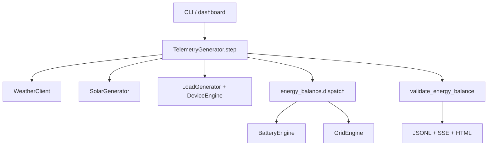

# Simulator

Standalone solar-home telemetry generator for Suryaa. One tick composes weather, PV, load, battery, and grid. Night solar is zero. Charge and discharge are separate kW fields.

| | |
|---|---|
| **Project** | Suryaa telemetry simulator |
| **Stack** | Python 3.10+ (3.12 recommended) · Pydantic v2 · pydantic-settings · httpx |
| **Dashboard** | Stdlib HTTP + SSE — **not FastAPI** |
| **Tests** | pytest + pytest-asyncio (18 tests) |

> **What it is not.** Redis, Postgres, FastAPI, Docker, LangChain, or the main backend API. It sits next to `backend/` and `frontend/` as its own package. The simulator never sees Redis or Timescale.

**Sister docs:** [Auth](./auth.md) · [Onboarding](./onboarding.md) · [Telemetry ingest](./telemetry_ingest.md) · [Docs hub](./README.md)

---

## On this page

1. [Memory map](#1-memory-map)
2. [What we built](#2-what-we-built)
3. [Records](#3-records)
4. [CLI + dashboard APIs](#4-cli--dashboard-apis)
5. [Code workflows](#5-code-workflows)
6. [Energy + solar rules](#6-energy--solar-rules)
7. [Security / ops](#7-security--ops)
8. [Config](#8-config)
9. [Testing](#9-testing)
10. [Trade-offs](#10-trade-offs)
11. [Elevator pitch](#11-elevator-pitch)
12. [Cheat sheet](#12-cheat-sheet)

---

## Run

From the **repository root** (not from inside `simulator/`):

```bash
source simulator/.venv/bin/activate
python -m simulator.main --dashboard --weather-mode live
```

---

## 1. Memory map

### Tick flow

```
CLI / dashboard
     → TelemetryGenerator.step()          compose one reading
          → WeatherClient                 Open-Meteo or fallback
          → SolarGenerator                PV kW from GHI / night = 0
          → LoadGenerator + DeviceEngine
          → energy_balance.dispatch       priority: solar → batt → grid
          → BatteryEngine / GridEngine
          → validate_energy_balance       never stops the generator
     → stdout JSONL + live_bus SSE + dashboard HTML
```



| Layer | Job |
|---|---|
| `config.py` | Env + device catalog + scenarios |
| `models.py` | Pydantic records (`extra="allow"` so fields can grow) |
| `engines/` | One concern each: solar, load, battery, grid, devices |
| `dashboard/` | Stdlib HTTP server, not FastAPI |

### Folder map

```
volta.ai/
  backend/                      FastAPI auth / onboarding (separate)
  frontend/public/
    suryaa-dashboard.html       Live UI (dark teal / sun-gold)
  simulator/                    THIS PACKAGE
    main.py                     CLI + live clock loop
    __main__.py                 python -m simulator
    config.py                   SimulatorConfig + DEFAULT_DEVICE_CATALOG
    models.py                   Weather / Location / Device / Telemetry
    clients/weather.py          Open-Meteo fetch + cache + fallback
    clients/geocoding.py        City search + GPS coords → timezone
    engines/solar.py            PV from GHI, cloud, rain, inverter clip
    engines/load.py             Base load + occupancy + appliances
    engines/device.py           Catalog schedules (cyclic / windows / AC)
    engines/battery.py          SOC persist; charge/discharge as separate kW
    engines/grid.py             Import/export, outage window, zero-export
    engines/energy_balance.py   Dispatch order + AC-bus check
    telemetry_generator.py      One tick = all engines → TelemetryRecord
    dashboard/live_bus.py       Thread-safe latest + history for SSE
    dashboard/location_state.py Current home + stop flag
    dashboard/server.py         Serves HTML + /api/* + Stop shutdown
    data/telemetry.jsonl        Append-only output
    tests/test_simulator.py     18 tests
    .env.example                Optional overrides
```

---

## 2. What we built

### Core generator

- Real-time solar home: weather, PV, load, battery, grid, devices
- One JSON object per interval on stdout + JSONL file
- Seeded randomness (`RANDOM_SEED`) so runs are repeatable
- Scenarios without rewriting engines
- Energy-balance warning **never kills the loop**

### Weather

- Open-Meteo forecast (no API key, CC BY 4.0)
- Fetch at startup + every `WEATHER_REFRESH_MINUTES` (default 30) — **not** on every telemetry tick
- Modes: `live` · `fallback` · `historical-style`
- API failure → cached hour, else deterministic Pune-climate fallback

### Location — keep both

1. **City search** — Open-Meteo Geocoding (CLI `--location`, dashboard search)
2. **Browser GPS** — `navigator.geolocation` → POST coords; `timezone=auto`

Default home: Pimpri-Chinchwad, lat `18.6298`, lon `73.7997`, `Asia/Kolkata`.

### Live dashboard

- `--dashboard` serves `frontend/public/suryaa-dashboard.html` at [http://127.0.0.1:8765](http://127.0.0.1:8765)
- SSE `/api/stream`; defaults to live clock, 1 reading per real second
- Search city, My location, Stop (kills the process = Ctrl+C from the UI)

---

## 3. Records

There is **no Postgres**. State is in-memory engines + append-only JSONL.

### `WeatherRecord`

`temperature_c`, `humidity`, `cloud_cover`, `precipitation`, `wind`, shortwave / direct / diffuse radiation (W/m²), `weather_code`, `sunrise`, `sunset`, `source`, `data_quality`.

### `LocationRecord`

`name`, `lat`, `lon`, `timezone`, `country`, `elevation`, `source`  
(`open-meteo-geocoding` · `browser-gps` · `config` · `fallback`)

### `DeviceReading`

`device_id`, `name`, `type`, `rated_power_kw`, `current_state`, `current_power_kw`, `energy_interval_kwh`, `critical`, `controllable`.

### `EnergyFlows`

`solar_to_home` / `solar_to_battery` / `solar_to_grid`  
`battery_to_home` / `grid_to_home` / `unserved_load`  
`solar_curtailed_kw`  
`grid_to_battery_kw` — reserved, always `0` (no grid charging by default)

### `TelemetryRecord` (`extra="allow"`)

| Group | Fields |
|---|---|
| Identity | `timestamp`, `household_id`, `data_source="simulator"`, `data_quality` |
| Solar | `solar_power_kw` + energy today / total / interval |
| Load | `home_load_power_kw` + consumption today / total / interval |
| Battery | `soc` / `soh` / `charge_kw` / `discharge_kw` / `status` |
| Grid | `grid_status` / import / export / totals |
| Balance | flow fields + `energy_balance_status` / `error` / `valid` |
| Nested | `devices[]`, `weather{}`, `location{}` |

> **Interview line.** Charge and discharge are separate non-negative kW fields. Never infer direction from the sign of one `battery_power` value.

---

## 4. CLI + dashboard APIs

### CLI — `python -m simulator.main`

| Flag | Meaning |
|---|---|
| `--weather-mode` | `live` · `fallback` · `historical-style` |
| `--dashboard` | Serve the live UI |
| `--dashboard-host` | Default `127.0.0.1` |
| `--dashboard-port` | Default `8765` |
| `--interval-seconds` | Default `60`; dashboard forces `1` unless overridden |
| `--speed` | Wall-clock multiplier; `0` = as fast as possible |
| `--start-time` | ISO-8601; if omitted, live clock (`datetime.now`) |
| `--ticks N` | Stop after N readings (`0` = until Ctrl+C / Stop) |
| `--scenario` | See [Energy + solar rules](#6-energy--solar-rules) |
| `--location "Pune, India"` | Open-Meteo geocode on start |
| `--country-code IN` | Geocode hint |
| `--no-geocode` | Keep `.env` `LATITUDE` / `LONGITUDE` |
| `--pretty` / `--quiet` | Print JSON or silence stdout |
| `--solar-capacity-kwp` | Nameplate PV |
| `--battery-capacity-kwh` | Nameplate battery |
| `--household-id` | e.g. `home_001` |

### Dashboard HTTP (stdlib, not FastAPI)

| Method | Path | Job |
|---|---|---|
| `GET` | `/` | `suryaa-dashboard.html` |
| `GET` | `/api/latest` | Last `TelemetryRecord` |
| `GET` | `/api/history?limit=120` | Ring buffer |
| `GET` | `/api/stream` | SSE |
| `GET` | `/api/geocode?q=` | City search |
| `GET` | `/api/location` | Current `LocationRecord` |
| `POST` | `/api/location` | Set city object **or** GPS `{lat, lon, source}` |
| `POST` | `/api/stop` | Local-only; close SSE, exit process |

Always open via `http://127.0.0.1:8765` — never `file://`. GPS and SSE need a secure / localhost origin.

---

## 5. Code workflows

### A. One telemetry tick

1. Convert timestamp to household timezone.
2. `WeatherClient.get_weather` (cache lookup or fallback).
3. `SolarGenerator.compute_power_kw` (0 at night).
4. `LoadGenerator.generate` = base load + `DeviceEngine.step`.
5. `grid_is_available` (`GRID_AVAILABLE` + optional `GRID_OUTAGE_WINDOW`).
6. `dispatch_energy` (priority list below).
7. Actual solar = `solar_to_home + solar_to_battery + solar_to_grid`. Served load = `solar_to_home + battery_to_home + grid_to_home`.
8. Accumulators: solar kWh, load kWh, battery SOC, grid import / export.
9. `validate_energy_balance` — warning only, loop continues.
10. Publish JSONL + `live_bus`; dashboard SSE clients see it.

### B. Live clock vs simulated time

`--dashboard` with no `--start-time`: each tick uses `datetime.now(tz)` and sleeps until the next whole second (clocks show `22:04:01`, `22:04:02`, …).

Do **not** pass `--speed 60` for live viewing — that jumps simulated time by one minute per tick.

`--start-time` present: simulated clock advances by `interval_seconds`; `speed` controls wall sleep.

### C. Open-Meteo weather

1. `GET api.open-meteo.com/v1/forecast` — lat, lon, timezone, hourly fields, `daily=sunrise,sunset`
2. Cache hourly rows; interpolate between hour0 and hour1
3. Refresh every `weather_refresh_minutes` **or** if the hour is missing
4. On HTTP failure: reuse cache; if empty, `fallback_weather()`
5. `overlay_scenario()` then applies `cloudy_day` / `rainy_day` / `sensor_failure`

### D. City search (option 1)

- CLI: `--location "Pune, India"` or `GEOCODE_ON_START` + `LOCATION_NAME`
- Dashboard: type city → `GET /api/geocode` → pick result → `POST /api/location`

Open-Meteo Geocoding `/v1/search` (no key). First match → lat, lon, timezone, elevation. `TelemetryGenerator.apply_location` recreates `WeatherClient` and warmups.

Failure: keep Pimpri-Chinchwad / `.env` coords; `data_quality=fallback`.

### E. Browser GPS (option 2)

1. Dashboard on load (and My location) calls `getCurrentPosition`.
2. `POST { latitude, longitude, source: "browser-gps" }`.
3. Server: Open-Meteo forecast `timezone=auto` → timezone + elevation.
4. No reverse city name (Open-Meteo has none) → chip `GPS · lat, lon`.
5. Permission denied → city search still works.

Keep both: GPS = I’m here; search = simulate another home (or VPN / denied permission).

### F. Stop button

1. Frontend closes `EventSource` (no reconnect).
2. `POST /api/stop` (`127.0.0.1` / `::1` only).
3. `live_bus.close()` wakes SSE waiters; HTTP server shutdown.
4. Main loop sees `stop_requested`; SIGINT exits the process.
5. Open-Meteo calls stop even if you cannot find the terminal.

Restart: run `python -m simulator.main --dashboard` again.

---

## 6. Energy + solar rules

### Dispatch priority

1. Solar → home
2. Solar surplus → battery
3. Remaining surplus → grid (`0` if `zero_export_mode`)
4. Battery → home
5. Grid → home
6. Unserved load if grid down and battery at min SOC

### Solar

```
solar_power_kw =
    capacity_kwp
  × (GHI_wm2 / 1000)          # clip 0–1.2
  × efficiency (0.82)
  × shading (0.95)
  × temperature_factor        # derate above 25 °C
  × cloud_factor / rain_factor  # ONLY if GHI was synthesized (clear-sky sine)
  × small seeded noise
```

- Night (before sunrise / after sunset) = **0**
- Never exceed `inverter_capacity_kw`
- Measured Open-Meteo GHI already includes clouds / rain — do not derate twice
- If GHI missing in daylight → sine curve, then apply cloud / rain
- `sensor_failure` (degraded + GHI 0) → solar 0 (no sine fallback)

### AC-bus check (tolerance 0.05 kW)

```
solar + grid_import + battery_discharge
    ≈ home + grid_export + battery_charge
```

Fail → `energy_balance_status="warning"`, `warnings[]` filled, **keep running**.

### Battery

- SOC persists between ticks
- Charge and discharge never in the same interval
- SOC tank = `battery_usable_capacity_kwh` (capped by nameplate)
- Clamp: min SOC (default 20%) … 100%
- Default: cannot charge from grid
- Grid import and export are never both &gt; 0 in the same interval

### Default devices

| Device | Schedule |
|---|---|
| Refrigerator | Cyclic, critical |
| Washing machine | Morning window, every other day |
| Water heater | Morning + evening windows |
| Air conditioner | Hot **or** afternoon / evening windows |
| Water pump | Short morning window |

### Scenarios

| Scenario | Effect |
|---|---|
| `normal_day` | Baseline |
| `cloudy_day` / `rainy_day` | Weather overlay |
| `battery_low` / `battery_full` | Initial SOC |
| `grid_outage` | `GRID_AVAILABLE=false` |
| `high_evening_load` | Evening base × 1.85 + AC on |
| `sensor_failure` | GHI zeroed, `data_quality=degraded` |

---

## 7. Security / ops

This is a **local generator**, not an API product.

- [ ] No passwords, JWT, or user DB
- [ ] Dashboard binds `127.0.0.1` by default
- [ ] `POST /api/stop` is local-only (`127.0.0.1` / `::1`)
- [ ] Open-Meteo: no key; ~10k calls/day — cache 30 min, Stop to halt calls
- [ ] Attribution required (CC BY 4.0 / GeoNames)
- [ ] `.env` optional; secrets are not required for weather
- [ ] `extra="allow"` on records so old JSONL stays readable after new keys
- [ ] Never open the HTML as `file://` (GPS + SSE break)

---

## 8. Config

`.env` (copy from `.env.example`) **or** CLI flags. Extra env keys are ignored. No code change to tune a home.

| Group | Keys |
|---|---|
| Home | `HOUSEHOLD_ID`, `TIMEZONE`, `LATITUDE`, `LONGITUDE`, `LOCATION_NAME` |
| Geocode | `GEOCODE_ON_START`, `LOCATION_COUNTRY_CODE` |
| PV | `SOLAR_CAPACITY_KWP`, `INVERTER_CAPACITY_KW`, `SOLAR_EFFICIENCY`, `SHADING_FACTOR` |
| Battery | `BATTERY_CAPACITY_KWH`, `INITIAL_BATTERY_SOC_PERCENT`, `BATTERY_MINIMUM_SOC_PERCENT` |
| Grid | `GRID_AVAILABLE`, `ZERO_EXPORT_MODE`, `GRID_OUTAGE_WINDOW=14:00-16:00` |
| Weather | `WEATHER_MODE`, `WEATHER_REFRESH_MINUTES`, `SCENARIO`, `RANDOM_SEED` |
| Devices | `DEVICE_CATALOG_JSON` — override the five default appliances |

`BATTERY_USABLE_CAPACITY_KWH` is stored / CLI-set (80% of nameplate) but SOC math currently uses `battery_capacity_kwh` (nameplate).

Switch live weather off without code change:

```bash
WEATHER_MODE=fallback
# or
python -m simulator.main --weather-mode fallback
```

---

## 9. Testing

```bash
cd repo-root
source simulator/.venv/bin/activate
pytest simulator/tests
```

18 tests. Coverage includes:

- Night solar = 0
- Cloud and rain derate PV
- Inverter clip
- SOC never below min / never above 100%
- Grid import 0 on outage
- Zero-export clips export
- Energy balance within 0.05 kW
- Open-Meteo failure → fallback
- Devices add to home load
- Random seed repeatability
- Geocode parse + API failure keeps default coords
- GPS `timezone=auto` parse + forecast failure keeps lat / lon
- `live_bus.close()` drops publish and waiters

No real network required for the suite (httpx calls are monkeypatched).

---

## 10. Trade-offs

<dl>

<dt>Why no FastAPI / Redis / Postgres in the simulator?</dt>
<dd>It is a data generator. Stdlib HTTP + SSE is enough for a local dashboard. The real product API stays in <code>backend/</code>.</dd>

<dt>Why not call Open-Meteo every second?</dt>
<dd>Free tier ~10k/day. Weather is hourly; we cache and refresh every 30 min. Live ticks only interpolate the cached hour.</dd>

<dt>Why keep city search <em>and</em> GPS?</dt>
<dd>GPS = current device. Search = another city, CLI, permission denied, VPN. GPS-only would block “I’m in Goa, simulate a Pune home.”</dd>

<dt>Why no reverse-geocoded city name on GPS?</dt>
<dd>Open-Meteo has no reverse endpoint. We take <code>timezone=auto</code> and show coords.</dd>

<dt>Why energy-balance failure does not stop the process?</dt>
<dd>A simulator that dies on a 0.06 kW rounding error is useless for demos. We flag warning and keep streaming.</dd>

<dt>Why <code>charge_kw</code> and <code>discharge_kw</code> instead of signed battery power?</dt>
<dd>Signed power is ambiguous at 0 and easy to misuse in UI / agents. Two non-negative fields match how inverters report.</dd>

<dt>Why <code>--dashboard</code> quiets stdout?</dt>
<dd>One JSON line per second floods the terminal; SSE is the live channel. Use <code>--pretty</code> if you still want JSON printed.</dd>

</dl>

---

## 11. Elevator pitch

> I built a standalone Suryaa solar-home telemetry simulator next to the FastAPI backend. Each tick composes weather, PV, household load, battery, and grid into one JSON record with an energy-balance check that never stops the loop. Live weather comes from Open-Meteo and is cached for 30 minutes; night solar is zero; charge and discharge are separate kW fields. Location can be a geocoded city or browser GPS. A small stdlib HTTP dashboard streams SSE at the real clock so you can watch the home live, search a city, use My location, and Stop the process to halt API calls without finding the terminal.

---

## 12. Cheat sheet

| Topic | File |
|---|---|
| Architecture / CLI | `simulator/main.py` |
| Config + devices | `simulator/config.py` |
| Records | `simulator/models.py` |
| Compose one tick | `simulator/telemetry_generator.py` |
| Dispatch + balance | `simulator/engines/energy_balance.py` |
| Weather + fallback | `simulator/clients/weather.py` |
| City + GPS location | `simulator/clients/geocoding.py` |
| PV rules | `simulator/engines/solar.py` |
| Appliances | `simulator/engines/device.py` |
| SOC engine | `simulator/engines/battery.py` |
| Import / export | `simulator/engines/grid.py` |
| SSE bus | `simulator/dashboard/live_bus.py` |
| Dashboard + Stop | `simulator/dashboard/server.py` |
| Live UI | `frontend/public/suryaa-dashboard.html` |
| How to run | `simulator/README.md` |
